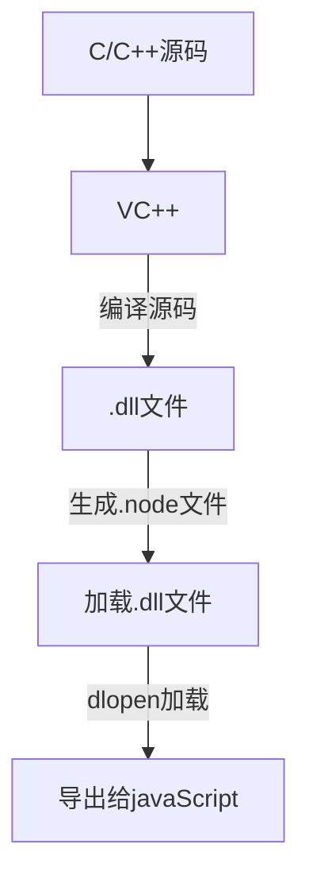

### node.js 与 C/C++ 数据互通

<u>一、首先了解下node.js 模块的编译。</u>

`.js `文件，是`fs`模块同步读取文件后编译执行。

`.node`文件，`C/C++ `编写的拓展文件，通过`dlopen()` 方法加载最后编译生产的文件。

`.json`文件 通过`fs`模块同步读取数据，用`JSON.parse()`解析返回结果。

其余拓展文件，都被当作`.js`文件载入。

<u>二、`.node`文件的生成</u>

- 拓展文件的编译和加载在不同同台上也不尽相同,下图展示[^ windows] 平台编译加载过程



<u>三、编译条件</u>

- `.net framework 4.5 +`
- `windows-bulid-tools ` 和`VS2017 & python2.7(3.x不支持)`，只需安装其中一个，博主使用的 `windows-bulid-tools`  `npm install -g windows-bulid-tools`
- `node-gyp` ：用于编译原生C++ 模块 `npm install -g node-gyp`
- `bindings` ：非必须条件，该模块可检查.node的位置
- `node-addon-api`: 实现C++ 插件有三种选择：`N-API`、`nan`、或直接使用`V8、libuv和node.js库`;`node-addon-api`：是对N-API的封装，不仅简化了N-API的使用，同时也保留了N-API的优点。

<u>四、示例</u>

- 创建项目

  > mkdir node
  >
  > cd addon
  >
  > npm init
  >
  > npm i node-addon-api bindings -S

- 新建编写 

  `node/grade.h`

  ```c++
  #include <iostream>
  
  /***
  	声明 grade 类，包含静态成员函数judeg。博主C++写的不好，多多包涵。
  **/
  class grade
  {
  public:
      static  char* judge(float grade){
          if(grade<60){
              return "bad!";
          }
          return "good!";
      }
  };
  ```

  `node/addon.cc`

  ```c++
  //napi.h 是node-addon-api 的头文件。里面封装了 N-API的头文件
  #include <napi.h>
  #include <iostream>
  //引入自定义 grade 类的头文件
  #include <grade.h>
  //明明空间 Napi
  using namespace Napi;
  
  // info 是 javaScript 传入的参数
  Napi::String result(const CallbackInfo& info){
          // 将javaScript 转为N-API 的类型，将N-API 类型转为C++类型
      float grade =  info[0].As<Number>().ToNumber().FloatValue();
  
      // grade::judge(grade) 调用自定义C++ 函数，返回 char* 类型
  
      // 将char* 类型转为N-API 的 String 类型
      return String::New(info.Env(), grade::judge(grade));
  }
  
  Napi::Object Init(Env env,Object exports){
      /***
      导出 将 result函数以 result 命名导出
      如下，可以导出n条所需函数：
      exports.Set("a"，Function::New(env,b))
      exports.Set("c"，Function::New(env,d))
      */
      exports.Set("result",Function::New(env,result));
      return exports;
  }
  
  // napi的句柄，无需改动
  NODE_API_MODULE(addon, Init);
  ```

  `node/binding.gyp`

  ```json
  {
    "targets": [
      {
        "target_name": "addon",//导出的模块名称
        "sources": [
          "addon.cc",//源文件
        ],
        "include_dirs": [
          "<!@(node -p \"require('node-addon-api').include\")", //使用到的源文件
          "./"
        ],
        "libraries": [],
        "dependencies": [
          "<!(node -p \"require('node-addon-api').gyp\")"
        ],
        "cflags!": ["-fno-exceptions"],
        "cflags_cc!": ["-fno-exceptions"],
        "defines": ["NAPI_CPP_EXCEPTIONS"],
        "xcode_settings": {
          "GCC_ENABLE_CPP_EXCEPTIONS": "YES"
        }
      }
    ]
  }
  ```

- `执行npm i 或者 node-gyp rebuild`

  控制台编译成功后，生成build 文件，bulid/Release/addon.node文件

  

- 创建`node/app.js`

  ```javascript
  const addon = require('bindings')('addon');
  console.log(addon.result(90));
  ```

  执行 `node app.js`  控制台输出 good!

  

- 总结

  转化流程可以粗略用以下流程展示

  ```mermaid
  graph LR
     javaScript --类型转化--- N-API
     N-API --类型转化--- C/C++
  ```

